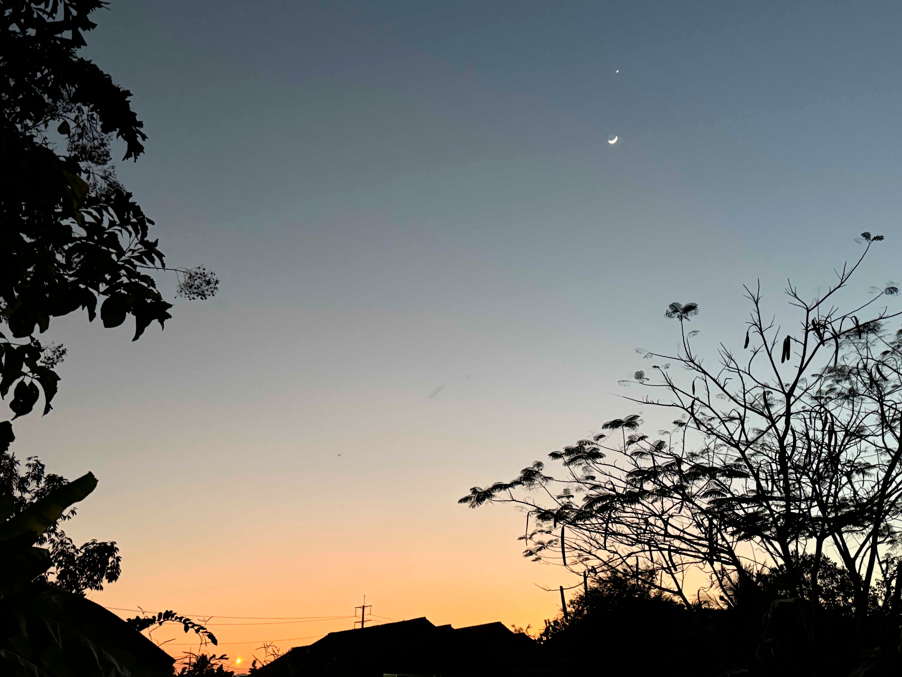
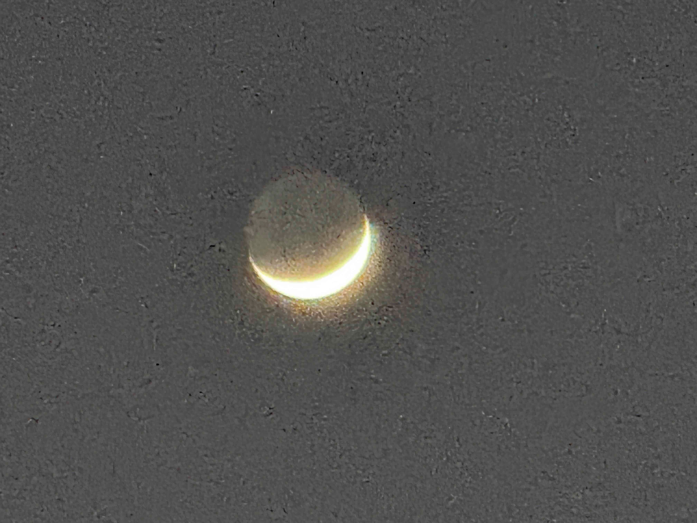
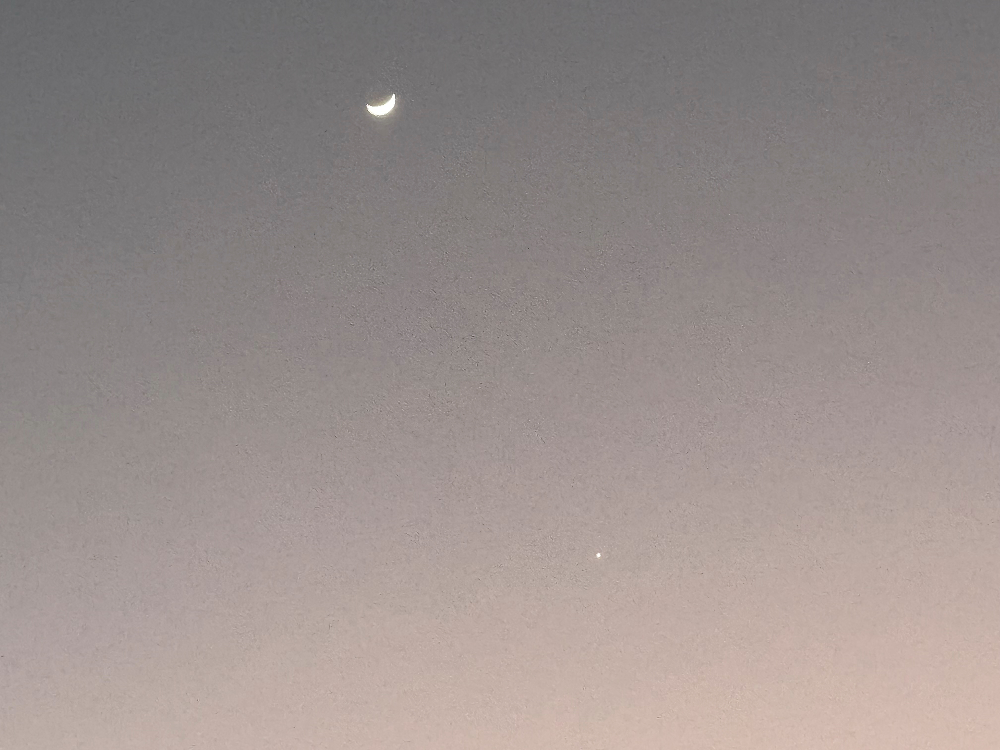
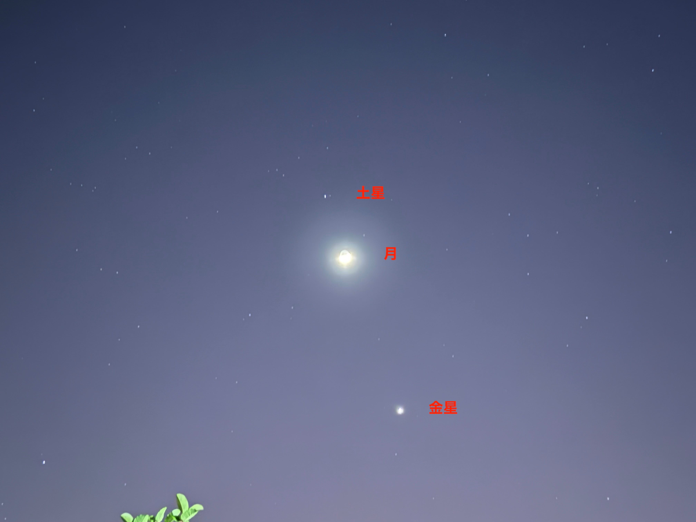
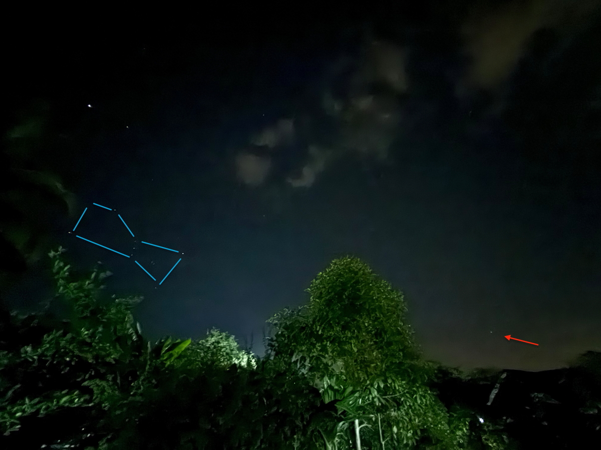
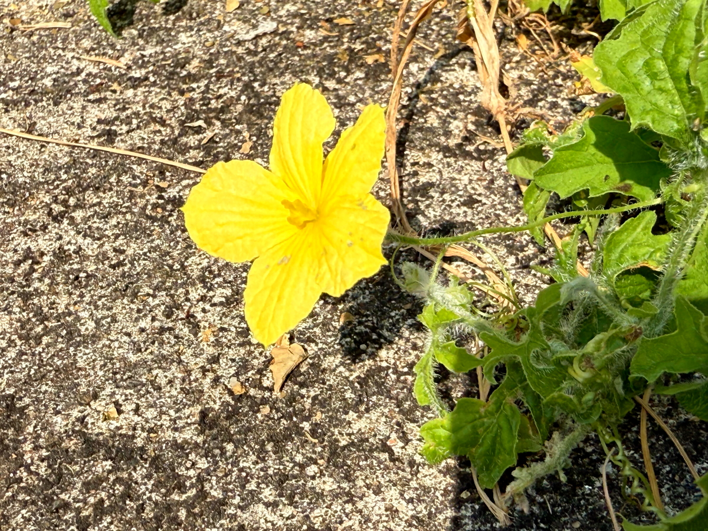
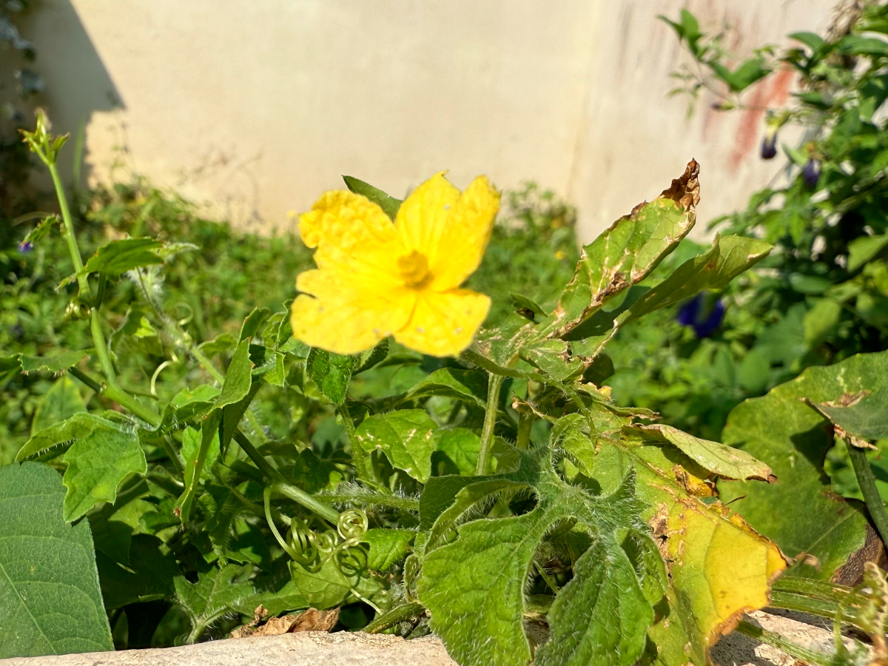

# 20250104_chiangrai

<html>
<head>

<meta charset="UTF-8">
<meta http-equiv="Content-Type" content="text/html; charset=UTF-8">
<meta http-equiv="X-UA-Compatible" content="IE=EmulateIE10" />
<meta http-equiv="X-UA-Compatible" content="IE=edge">

<!--ここから上はお決まりの定型文です-->

<!--ここからが表現の書式などを決めるcssという部分-->

<link href="https://cdnjs.cloudflare.com/ajax/libs/lightbox2/2.7.1/css/lightbox.css" rel="stylesheet">

</head>

<body>

モバイル端末をお使いの場合は、画面を横向きにすると
より見やすくご覧頂けます。

<!--ここ上は、ほぼそのまま使います！-->

<!--QRコードの挿入例-->

 アクセス用QRコード

<marquee direction="left" scrollamount="20" width="30%">(^_^)/~alis</marquee>

<!--流れ文字の挿入例-->
<h1><marquee behavior="left">!!! 2025/01/04 、タイの綺麗な夕暮れと星空、庭の花々と日本との決定的な違い !!!</marquee></h1>

                          

<!--ここから下が、本体部分-->

<h2>この時期の夕焼けグラデーションはすごく綺麗です 1月3日は月と金星が並ぶ天文イベントでした</h2>

<h2>金星の下に月が並びました</h2>

<h2>一年中屋外プールで泳げるのも良いところ</h2>

<h2>花壇のお花はいつも満開</h2>

<h2>市街地以外はほぼ田んぼなので、空気は綺麗です</h2>

<h2>4日には金星と月の位置が入れ替わりました</h2>

<h2>日が暮れると土星と月、金星が並ぶ天文イベント、世界中で見られたはずです</h2>

<h2>オリオン座の右の星(赤矢印)は、日本では見るのが難しいエリダヌス座のα星「アケルナル」</h2>

 
<h2><a href="https://turupura.com/guide/star/akerunaru.html" target="_blank">アケルナルはかなりマニアックなので説明リンク貼ります（この文字クリック）</a></h2>

  
<h2>庭の雑草もお花を咲かせます</h2>

<h2>あまり騒がれませんが、タイは銃社会なので、道にこんなものが落ちてます 男子は兵役義務があるので銃の扱いは仕込まれています</h2>

  
<h2>車の流れが日本みたいにギスギスしないのは、車内に銃がある可能性が高いからかな？と邪推してます</h2>

<h2>以上、今回は夕焼け空が多めでしたが、ここまで観ていただきありがとうございました。</h2>

     
<h2>
<a href="https://torokoid.github.io/20241126_chiangrai/" target="_blank">Back to the menu page</a>
</h2>

   

         

  

      

<!--本体はここまで-->

<!--画面に空白地帯を作って、背景が見えるようにしています-->
                                              

<!-- フッタ -->
<footer>

Copyright 2025/01/05 alis @ChiangRai

</footer>

<!--HPにさまざまなJavaScriptを呼び込むための書式-->

